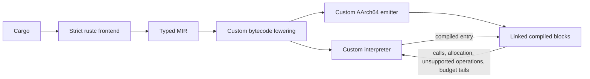

# Custom interpreter and linked AArch64 JIT

The retained experimental build is `57a54edd` (the production binaries measured
as `af9aa691`). It adds local-memory forwarding to the preceding scalar-promotion
and packed-register-cache engine. A bounded table of 16 exact local byte ranges
records currently materializable values for widths 1, 2, 4 and 8. Loads and copy
sources can reuse them. Register overwrite/eviction and overlapping or unknown
writes invalidate facts; region boundaries reset the table. Forwarding preserves
truncation, memmove source capture, destination checks, stores, cache replacement
order, final dynamic spills and logical instruction budgets. It never reloads
an evicted dead register from an array slot that may not have been spilled.

Qualification passes 183 bytecode tests, 11 exporter tests, 47,004 native
differential commands, 245 TLS checks and 382 fresh fre tests against native;
seven fre tests remain ignored. The final test-only oracle correction leaves
both production binaries identical. Across nine actual edit workflows, 25/45
complete commands improve against the preceding build, 30/45 against native and
29/45 execution stages improve. All four compute workflows have lower paired
command medians, but corpus and cold results are mixed. Native remains much
faster on token and folded. [Full evidence](results/local-memory-forwarding-01/summary.md).

The preceding experimental build is `6bf10fda`: restricted MIR scalar promotion
combined with the packed native cache. Proven non-addressed primitive locals
use VM registers. Entry-initialization proofs prevent unnecessary whole-frame
register clearing, and block-local move forwarding preserves values across
source overwrites. ABI arguments/results, escaping addresses and aggregates
remain excluded. Native final spills and strict rustc checking are preserved.

The combination passes 172 bytecode tests, 11 exporter tests, 47,004 native
differential commands, 245 TLS checks and all 382 active freshly exported fre
tests against fresh native executions; seven remain ignored. Nine edit
workflows win 30/45 complete commands against f45 and 33/45 against native.
The four compute workflows improve overall, but larger Nushell regresses
558 ms and several cold samples are slower. Both binaries reproduce exactly.
[Complete evidence](results/scalar-packed-cache-01/summary.md).

The preceding build uses x5/x6 for two dynamic values with known-zero upper halves,
or one full 128-bit value. Each narrow value owns one native register; a wide value
owns both. Eviction prefers the less recently materialized slot, retaining the
existing conservative spill rules. Overwrites invalidate every slot owned by the
old value. Medium copies evict both slots before using them as scratch. Native
exits retain final register slots required by the existing ABI tests.

All 169 bytecode tests, 47,004 native differential commands, 245 TLS checks, and
382 non-ignored fre tests pass. Four real-edit workflows improve 15/20 commands
and all 20 execution stages against retained88; native wins 15/20 commands. The
exporter binary is identical, all 28 artifact pairs match, and both binaries
reproduce in a fresh build. [Results](results/packed-native-cache-01/summary.md).

The preceding build adds CompareBytes in the custom AArch64 assembler. Both
complete read ranges are validated before inspecting any byte. Unaligned
8-byte chunks are compared for equality; on a difference, REV restores lexical
byte order before unsigned comparison. Byte tails never read outside the range.
Empty ranges accept dangling pointers, high operand halves truncate to usize,
and outputs are exactly u32::MAX, zero or one in a zero-extended u128 register.
All inputs are read before an aliased output is published. Scratch registers
preserve the x5/x6 cache and existing ABI. One comparison remains one logical
instruction; budget tails and native-code-cap fallback retain VM behavior.

All 165 bytecode tests, 47,004 native differential commands and 245 TLS checks
pass, as do 382 non-ignored fre bodies at the explicit150k budget. Four edit
workflows yield 14/20 parent wins and 6/20 native wins, with a targeted 244 ms
execution saving in token-phrase. Other execution stages are essentially flat;
folded's command regression and the initial TLS runtime regression are retained.
Native remains much faster on token-phrase. The exporter binary and strict
frontend are unchanged. [Native comparison results](results/native-compare-bytes-01/summary.md).

The preceding allocation-budget build adds `Limits::allocations` and the VM/launcher
`--allocation-limit` flag, with default 100,000 and maximum one million. Byte
memory has a separate budget. At 150,000 all 382 non-ignored retained fre bodies
pass; seven are ignored. All 161 bytecode tests and the broad native/TLS gates pass.
The emitter is unchanged from the preceding register-cache build. This capability
retains a roughly 10 ms default interpreter regression; the new exhaustive-test
edit loop still loses all five native comparisons.
[Allocation-budget evidence](results/allocation-budget-01/summary.md).

The preceding experimental build adds a block-local cache for one complete dynamic
128-bit register value. After the existing heap-argument relocation, caller-saved
x5/x6 are available without prologue or ABI overhead. Reads of the cached value
use native register moves; eviction spills values conservatively needed later or
outside the region. Exits spill the remaining dynamic value, preserving native
ABI tests that inspect the final slot. Constant and local-address facts retain
their existing liveness rules. No facts cross native block boundaries.

Known-zero upper halves are represented logically and materialized from xzr.
Overwrites invalidate the old owner, including aliased arithmetic/overflow
destinations. Copies of 17–32 bytes evict before reading operands because their
implementation uses x5/x6. Guest memory, bytecode, complete instruction accounting,
frame initialization, call handling and the strict frontend remain unchanged.

All 151 bytecode tests, 47,004 native differential commands, 245 TLS checks and
the retained 381/1/7 fre classifications pass. A separate two-input diagnostic
matches 108 complete sparse execution traces for bodies affected by host random
inputs. Eight production-edit workflows yield 29/40 wins against the parent and
29/40 against native; all fifteen targeted folded-trie/TLS/SHA-1 commands improve.
Native still wins every folded-trie and SHA-1 pair. Other workflows are mixed,
and no broad warm-build gain is established.
[Register-cache results](results/native-register-cache-01/summary.md).

The current candidate generates native code when a function first executes. The
Rust frontend and complete bytecode validation remain strict. Each function is
staged in ordinary memory with its block relocations and assertion identities;
publication appends to a stable arena before making the entries visible. Earlier
native code is never relocated or patched. Functions that exceed the remaining
16 MiB code budget are interpreted by this project's VM, and the decline is cached.
A smaller `Limits::jit_code_bytes` budget is available for controlled comparisons;
requests above 16 MiB fail. The byte-memory and live-allocation limits are
separate; the latter defaults to 100,000 and is explicitly configurable up to one million.

Preparation runs at entry, guest calls, and TLS callback transitions. The normal
instruction dispatch loop has no added readiness check. Diagnostic statistics now
record compiled and declined function counts, committed native bytes, and the sum
of initial setup and first-compilation time. Full instruction accounting, native
fault returns, profile counts, and batch/TLS resets remain active.

The arena retains the existing macOS `MAP_JIT` and per-thread write-protection
protocol. Appends occur only while this single-threaded guest is outside generated
code; protection is restored and the new instruction range invalidated before
publication. This follows [Apple's JIT porting guidance](https://developer.apple.com/documentation/apple-silicon/porting-just-in-time-compilers-to-apple-silicon).
The prototype has not adopted the separate JIT write-callback allowlist entitlement.

The completed cached-readiness build passes all 130 bytecode tests, broad native
checks, and 245 TLS checks. Retained-program replay passes 381 ordinary fre bodies
against fresh native controls; one reaches the allocation-count cap and seven
are ignored. The ready check is inlined; first compilation lives in a cold helper.
It improves all ten execution-stage pairs, but only five of ten complete edited
commands. [Results and limits](results/lazy-cached-guard-01/summary.md).

The wide-integer emitter candidate handles 128-bit subtraction and comparisons directly.
Subtraction propagates the low-half borrow into the high half and captures signed
or unsigned overflow before publishing results. Ordering compares signed or unsigned
high halves, using an unsigned low-half comparison when they tie. It does not narrow
128-bit enum tags. Bytecode, frontend behavior, and other wide-op interpretation
are unchanged. All 134 bytecode tests, broad native checks, 245 TLS checks, and
381 retained guest passes hold. Tuned folded trie wins 4/5 edited commands; TLS is
effectively flat. Eight workflows across all five projects complete with 20/40
command wins against the parent, 30/40 against native, and all 56 artifact pairs
identical. Ruff and larger Nushell have Cargo-stage regressions; no broad build-time
improvement is established.
[Wide-integer evidence](results/native-wide-integers-01/summary.md).

The selected implementation uses ordinary rustc frontend checking, exports
typed MIR into our bytecode, and executes it through our interpreter and direct
AArch64 emitter. The JIT currently targets Apple Silicon macOS. The pinned
compiler is `nightly-2026-09-08`; bytecode version remains 5.

No LLVM or existing interpreter runs the exported guest programs. Native Rust is a separate
correctness and performance control. The default frontend reports errors in
uncalled bodies too; the experimental partial-checking modes are separate.

The current export-time call pipeline bypasses identity wrappers before the
optional leaf pass, then runs forwarding again. Without leaf inlining it remains
the same single forwarding pass. Eligibility, frame/code-growth bounds, function
IDs and indirect-call handles are preserved. Inline timing still measures only
the leaf pass; forwarding diagnostics identify the before-inline and final stages.
The isolated retained-program screen improves all six runtime pairs. The complete
eight-workflow cohort wins 22/40 commands against the parent. Folded trie improves
4/5 commands (-62 ms paired); larger Nushell regresses 261 ms, mainly in Cargo.
Fresh exports preserve 381 fre passes, one identical allocation-capacity error and
seven ignored tests. All 138 bytecode tests and broad native gates pass. Retain
this as an experimental runtime improvement without a broad warm-build claim.
[Complete measurements](results/inline-order-01/summary.md).

The current exporter follows that call pipeline with jump threading, unreachable
code removal and deterministic basic-block layout. Jump-only cycles stay loops;
switch precedence, implicit fallthrough, side effects, function handles and layouts
are preserved. Layout falls back to threading if static code grows, and a change
that would introduce whole-function register clearing is rejected. Only the final
retained instruction stream is cloned. Execution budgets count the resulting
artifact; the VM does not transform hand-constructed programs implicitly.

This pass is retained experimentally after 143 bytecode tests, all broad checks,
245 TLS checks and fresh 381/1/7 fre coverage. Eight workflows yield 20/40 command
wins against the parent and 30/40 against native. Folded trie saves 24 ms paired,
TLS 8 ms, while short workflows are flat. Larger Nushell has a warm saving mostly
in Cargo but a 72-to-106-second cold regression. No broad warm-build improvement
is established. [Current CFG results](results/cfg-single-copy-01/summary.md).

## Direct forwarding: measured runtime experiment

The exporter redirects calls through functions containing only local addresses,
one direct call that forwards complete arguments unchanged, and return. It checks
argument/result widths and disjoint wrapper slots, resolves chains iteratively,
and preserves cycles. Function identities, indirect-call handles, argument/result
addresses, frame/register layouts, and static code sizes remain unchanged.

All 125 bytecode tests, two 23,502-command native suites, auxiliary gates, and 245
TLS checks pass. Fresh native controls preserve fre's 320 passing tests, 62 lowering
blocks, and 7 ignored tests. Independent audits verify all 91 artifact pairs from
thirteen workflows. The TLS-heavy batch removes 10,468,047 interpreted calls;
profiles match across both actual VM builds for each artifact.

The candidate wins 37/65 complete edited commands against its parent and 42/65
against native Rust. Paired median savings are 204 ms for the TLS workload, 51 ms
for folded-trie, 33 ms for word64, and 20 ms for inlined word64. Ruff and larger
Nushell regress by 98 ms and 264 ms, mainly in Cargo. Keep the pass as an
experimental runtime improvement; broad build-time improvement is not established.
The next comparison varies MIR optimization with the same custom JIT and strict
frontend, using complete production edits and the original tests.
[Full evidence](results/paired-direct-forwarding-corpus-01/summary.md).

## Guest TLS cleanup: preceding capability experiment

Checked guest C/System allocation now supports Rust's TLS destructor list. Guest
callbacks execute in LIFO order at entry completion and before each batch TLS reset;
the entry result survives cleanup, and cleanup failures fail the command. Queue
storage and callback frames obey the existing working-memory and execution limits.
No guest function pointer enters the host callback ABI.

The separately selected `--run-try-callbacks` requires `--trap-unsupported-calls`.
It materializes all intrinsic operands, executes the try callback and returns false
only after normal return. Actual panic, unwinding, unavailable calls and VM faults
remain command errors. The original strict rejection and trap-only behavior remain
available. Type and borrow checking remain strict in every mode used here.

All 119 bytecode checks pass. Native controls cover raw callback registration,
real std/System allocation, Vec-bearing TLS, reentrant destructor-list insertion,
repeated resets and the final test. The complete fresh fre survey improves from
303 to 320 passing bodies, with 62 lowering blocks and 7 ignored tests unchanged.
The original tracing instrumentation and tests are preserved. The five edited-command comparisons have median times of 2.42 s JIT and 1.88 s
native, with four JIT losses. Profiles identify 40.54 million interpreted calls
in the edited test batch. Both 23,502-command native suites and the other broad regression gates passed.
[Capability and edited commands](results/guest-tls-capability-01/summary.md).
[Fresh fre coverage](results/audit-execution-fre-guest-tls-01/summary.md).

## Direct dispatch after native exits: experiment

The working-tree VM now checks the remaining budget and dispatches the interpreted
continuation after a successful native exit. Native successors are already linked;
the former loop repeated its header and JIT lookup before the interpreted step.
All 107 bytecode tests pass, including short regions, calls, returns, exact loop
budgets, faults and missing-terminator ordering. The runtime screen wins 23/24
pairs with identical guest instruction counts, memory peaks, generated-code sizes
and per-PC profiles. It saves 124 ms for folded-trie and 69 ms for word64. Both
actual VM and exporter binaries differ from the prior population-count build.
Broad native checks pass. All twenty complete compute edit commands and execution
stages improve: paired command savings are 94 ms, 68 ms, 58 ms and 9 ms for folded-trie,
word64, inlined word64 and SHA-1. All twenty bytecode pairs are identical and rehashed.
Native Rust still wins 18/20 comparisons. Fresh native controls preserve all 303
passing fre tests and all 389 classifications, with 327 byte-identical artifacts.
The full twelve-workflow corpus wins 39/60 commands against the prior JIT and
42/60 against native. Ruff and larger Nushell regress by 180 ms and 383 ms in the
paired command medians, mainly in Cargo; no broad build-time improvement is claimed.
The dispatch implementation is retained as the experimental baseline for the next
capability work. The older results below describe the population-count build.
[Full corpus](results/paired-native-exit-dispatch-corpus-01/summary.md),
[selection decision](results/paired-native-exit-dispatch-corpus-01/decision.json).
[Fresh fre coverage](results/audit-execution-fre-native-exit-dispatch-01/summary.md).
[Edited-command comparison](results/paired-native-exit-dispatch-compute-01/summary.md).
[Runtime direction screen](results/native-exit-dispatch-real-screen-01/summary.md).

## Native population count experiment

The emitter now supports `CountOnes` at 8, 16, 32 and 64 bits. It masks the input,
counts bits per byte in caller-saved vector register v0, reduces the eight counts,
and writes a zero-extended result. The 128-bit operation retains the interpreter
path. Neighboring vector copies, aliased registers, loop budgets and assertion
fault order pass independent checks. All 104 bytecode tests and broad native
differentials pass; the exporter binary is unchanged.

The identical-artifact screen wins 19/24 pairs, but folded-trie regresses in 4/6.
Four complete production-edit workflows then win 14/20 commands. SHA-1 improves
all five, with 27 ms paired command and 19 ms execution savings. Word64 command gains
are mostly in Cargo, and folded-trie remains mixed; this is not a broad speed claim.
Fresh native controls preserve all 303 passing fre tests and all 389 classifications.
The full twelve-workflow corpus is complete: 37/60 wins against the prior JIT and
44/60 against native. Many gains occur outside execution; Ruff and folded-trie
retain regressions in some comparisons. Population count remains an experimental
baseline for a separate dispatch change, without a broad speed claim.
[Full corpus measurements](results/paired-native-popcount-corpus-01/summary.md).
[Fresh fre coverage](results/audit-execution-fre-native-popcount-01/summary.md).

## Native copies through 128 bytes

The experimental copy emitter now handles 33–128 bytes using caller-saved vector
registers. It checks both complete ranges before writing, loads the source before
stores to preserve overlap semantics, and keeps the existing path through 32 bytes.
Faults, live registers and exact budgets pass dedicated tests and native checks.
The complete twelve-workflow corpus wins 38/60 edited-command pairs; folded-trie
and both word64 configurations win all 15, while SHA-1 and frontend-heavy commands
remain mixed. The exporter is identical in both compared builds.
[Complete comparison](results/paired-native-medium-copy-corpus-01/summary.md).

Compiler-created scratch-frame reuse passed broad correctness and reduced memory
and runtime costs in a direction screen, but won only 10/20 complete edited
commands and lost all five inlined-word64 pairs. It was set aside; the prior
source and both binaries were rebuilt and verified exactly.
[Scratch-reuse evidence](results/paired-temporary-frame-compute-01/summary.md).

The current opt-in leaf inliner accepts body, argument and result copies through
128 bytes. Newly eligible aggregate leaves may add at most half the original
caller frame, including alignment padding. The existing 512-byte callee frame,
192-operation, register, code-growth, diagnostic and initialization limits remain.
This guard avoids reserving a large bank on every call for an unexecuted error
branch. Inlining stays off by default. The guarded version passes 101 bytecode
tests, broad native checks and all 303 previously passing fre tests against fresh
native controls. The twelve-workflow corpus improves 35/60 complete edited
commands and 30/47 changed-bytecode pairs, with retained Ruff and Nushell
regressions. Broad performance qualification remains unresolved.
[Guarded comparison](results/paired-native-medium-leaf-frame-guard-corpus-01/summary.md).

Fifteen real-edit control pairs with identical exporters, VMs and bytecode show
substantial command variation, particularly on larger Nushell. Small five-pair
differences alone are insufficient for selection. Retained candidates can now be
selected explicitly in the benchmark harness. Repeating the actual scratch-frame
comparison without changing the working tree gives 12/20 command wins, or 22/40
with the original run retained. Execution improves in 33/40 pairs, but inlined
word64 still has a small combined command regression; scratch reuse stays archived.
[Calibration](results/identical-tools-aa-e2e-01/summary.md).
[Actual recheck](results/paired-temporary-frame-recheck-01/summary.md).

A fresh diagnostic folded-trie CPU sample places 149 of 852 samples in frame
reservation, including clearing, and 63 in a copy path consistent with direct-call
argument copying. These are investigative leads, not predicted speedups.
[Sample and limits](results/folded-trie-guarded-cpu-sample-01/summary.md).

Empty unit-call removal was implemented and tested, then archived. It wins 11/20
complete production-edit pairs; folded-trie execution saves 26 ms but the command
saves only 2 ms in the median paired comparison. Word64 and inlined word64 remain
mixed. All 106 bytecode tests and broad native checks pass, but the command results
do not justify further qualification. The guarded source and both rebuilt binary
hashes are restored exactly. Both actual VM binaries differed in this experiment;
a separate crossed screen retains both artifact/VM combinations.
[Empty-call results and decision](results/paired-empty-unit-call-compute-01/summary.md).

## Native local fills

Small fills of a proven local frame range now use direct AArch64 stores. The
recognizer requires the exact local-address/byte/length sequence, distinct helper
registers, no branch into its middle, and a complete in-frame extent of at most
512 bytes. Zero-length fills preserve the endpoint rule; other patterns retain
their existing interpreter behavior. The emitter preserves live registers,
region boundaries and exact instruction-budget tails.

This reduces native/interpreter transitions introduced by the opt-in leaf
inliner. The repeated compute comparison improves 14/15 complete commands and
all 15 execution stages; the full eleven-workflow comparison has mixed smaller
and frontend-heavy changes. Strict frontend checking remains enabled. The
qualified build passes 88 bytecode tests, existing launcher/audit/SIMD checks,
23,502 native differential commands in each inlining mode, and fresh comparisons
of all 231 supported ordinary fre tests. Function-pointer body scheduling is now
deterministic, and both JIT builds execute identical artifacts in every pair.
[Current qualification](results/paired-jit-local-fill-corpus-02/summary.md).

The following block-link measurements describe the earlier optimization retained
under this change.

## Native block links

Previously every compiled block returned to the VM, including jumps to another
compiled block of the same function. Compiled successors now branch directly
to their validated internal entry points. External entries install a host-owned
cursor and preserve the native ABI. Every normal, budget, memory, division, and
assertion exit restores the saved registers and stack.

Each block checks and subtracts its virtual-instruction cost. If the remaining
budget cannot cover the next block, the chain returns that block's start PC and
the VM executes the partial tail one instruction at a time. Every native cycle
consumes budget. Full-u128 switch comparisons and first-match ordering remain.

Guest frames and storage stay fixed while a chain runs. Calls, allocations,
returns, and unsupported operations use the VM. Constant/address facts are
flushed at the same block boundaries as before, including loop-carried values.
Existing memory guards and proved local-frame access shortcuts remain.

Profiling emits per-block counter increments only in instrumented code. Its
counts agree with ordinary execution. The `jit_entries` statistic measures
host-to-generated-code calls, while `jit_instructions` counts virtual instructions
executed natively. The generated-code limit remains 16 MiB, and regions contain
at most 1,024 virtual instructions before linking.

## Measured effect

Six alternating immutable-VM pairs per case use identical production bytecode.
JIT runtime falls from 2.195 to 1.725 s for default word64, 1.472 to 1.093 s for
inlined word64, and 0.646 to 0.460 s for SHA-1, winning every pair. Interpretation
is approximately unchanged. Virtual instructions, compiled operation coverage,
and guest-memory peaks match the baseline.

Inlined word64 drops from about 107 million native entries to 36 million; SHA-1
drops from 67 million to 14 million. JIT construction adds only 0.04–0.19 ms in
these cases. Generated guest code grows by about 142 KB for word64 and 45 KB for
SHA-1; the VM executable is 464 bytes smaller.
[Runtime samples and provenance](results/jit-region-linking-runtime-01/summary.md).

All 15 paired complete build/test commands also improve, by median paired
differences of 438 ms, 316 ms, and 189 ms respectively. All compared bytecode is
identical, original tests remain unchanged, and every mode rejects a wrong edit.
Native still wins these compute workloads in the paired comparison. The full
nine-workflow corpus passes across all five projects.
[Paired commands](results/paired-region-linking-e2e-01/summary.md),
[qualified corpus](results/e2e-jit-region-linking-corpus-01/summary.md).

## Qualification and limits

The build passes 73 bytecode tests, 23,502 native differential/rejection commands,
and 99 launcher checks. The new tests verify native chaining, exact profiles,
large registers, region boundaries, interpreter gaps, heap-copy scratch registers,
fault/budget precedence, and ABI preservation through an assembly test wrapper.
Assembler output is an encoding oracle only; it does not produce guest code.
[Validation record](results/jit-region-linking-validation-01.json).

The runtime supports checked memory, guest allocation, collections, scalarized
SIMD, dynamic dispatch, scalar floating point, sequential atomics, mutable
statics, and single-thread TLS resets. Floating operations and unsupported native
arithmetic remain in our interpreter. Guest threads,
general OS/FFI, native unwinding, complete applications, and whole-suite harness
semantics remain unsupported.

The standalone CountOnes emitter was reverted after paired word64 commands
regressed, despite a SHA-1 improvement. It is preserved as an experiment, not part
of this qualified build. [Measurements](results/paired-popcount-e2e-01/summary.md).

[Launcher usage](INTERPRETER.md), [next work](RUNTIME-NEXT.md),
[earlier experiments](JIT-HISTORY.md).
