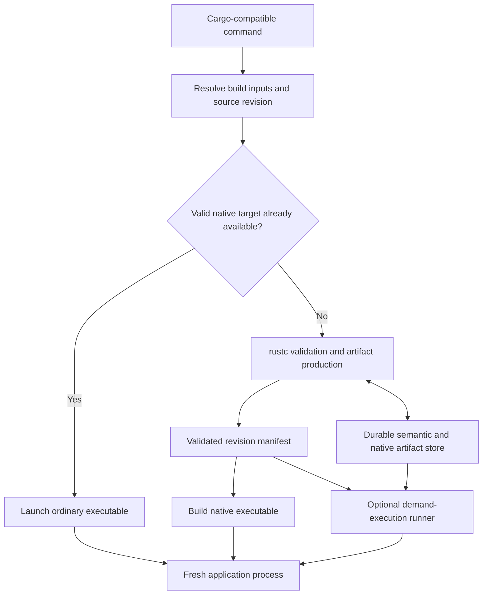

# A practical Rust development engine

Ongoing implementation: [JIT.md](JIT.md) tracks the custom native tier and
complete-command benchmarks that now guide development.

Implementation update: [INTERPRETER.md](INTERPRETER.md) records the custom
interpreter, five-project actual-edit measurements, and three checking policies.
The current next steps are compatibility with real tests, strict semantic reuse,
and a measured custom native tier for long workloads. The original design below
is retained as the rationale and acceptance contract; its initial native-only
stage has been completed and superseded by the interpreter experiment.
[RESULTS.md](RESULTS.md) records why function caching and unchanged executable
publication alone were insufficient.

Build a development engine whose primary feature is **retaining valid compilation work across edits and application restarts**. Use rustc for Rust semantics, preserve native execution for unchanged code, and make demand compilation an optional way to handle missing artifacts. An interpreter can be a useful execution tier, but it should not be the foundation of the warm-build strategy.

The intended result is an ordinary development workflow for large Cargo projects: edit code, obtain accurate diagnostics, and run tests or the application quickly. The design is general across application domains. It must handle both a large crate and a large graph of crates without requiring application-specific rewrites.

The reported cold/warm reversal is plausible, but its cause is not established: the prototype and its stage-level measurements are unavailable. The recommendations below are an engineering plan, not measured speedups. The numerical acceptance thresholds are proposed product requirements to fix before implementing the corresponding experiments.

**1. The central architectural decision**

Warm builds already have a strong advantage: much of the program has been checked, compiled, and linked. A replacement must preserve that advantage. Deferring work until execution saves time only when the work is avoided or its result is retained for subsequent runs. Repeating the same deferred work on every invocation creates a recurring tax.

The proposed development engine has three separable capabilities:

- **Incremental validation and artifact reuse:** reuse checked semantic results and native code whenever their actual dependencies are unchanged. This is mandatory.
- **Optional compiler residency:** keep useful indexes and artifacts in memory when that improves complete workflows within a memory budget. The durable cache remains useful after the service exits.
- **Optional demand execution:** compile missing functions when needed, or interpret them when that has a demonstrated cost advantage. Neither mechanism replaces validation or durable reuse.

The initial implementation should produce ordinary native binaries. That establishes whether better caching and invalidation solve the real problem before adding a new runtime, loader, or interpreter. If frontend work limits the achievable improvement, move into frontend/compiler integration before investing further in JIT machinery.

Develop this alongside the existing rustc/Cranelift work where possible. The accepted 2026 Cranelift goal already proposes exploring a function-code daemon, demand compilation, and interpretation of infrequently executed IR. That is a useful upstream collaboration point; those proposed directions are not evidence that the required implementation already exists. [Rust project goal](https://goals.rust-lang.org/2026/improve-cg_clif-performance.html).[^3]

**2. What the existing evidence establishes**

| Evidence | Implication for this design |
| --- | --- |
| Cranelift's JIT documentation explicitly warns that missing incremental compilation can make JIT slower than AOT. | The reported reversal has a concrete precedent; preserving reuse is a first-order requirement. [JIT usage](https://raw.githubusercontent.com/rust-lang/rustc_codegen_cranelift/db693f7dbcfab9af2a89b703096f692417e2f756/docs/usage.md).[^1] |
| The inspected Cranelift JIT driver collects mono items and compiles its function list before entering the application. It also has JIT-specific assembly and dependency-loading restrictions. | Historical descriptions of lazy JIT must not be treated as the current implementation or as proof of general Cargo compatibility. [Pinned JIT driver](https://raw.githubusercontent.com/rust-lang/rustc_codegen_cranelift/db693f7dbcfab9af2a89b703096f692417e2f756/src/driver/jit.rs).[^2] |
| Rust's accepted 2026 Cranelift performance goal reports February 2026 incremental Zed measurements of 5% improvement without debug info and 12% with line tables; its proposed backend target is 2×. | A substantially faster backend does not automatically produce a substantially faster development loop. These are one project's reported measurements, not universal estimates. [Rust project goal](https://goals.rust-lang.org/2026/improve-cg_clif-performance.html).[^3] |
| Rustc already tracks query dependencies and reuses results; its documented LLVM backend reuse boundary is the codegen unit. | Exploit existing correctness machinery, then measure the cost of coarse codegen reuse and the work remaining before that boundary. [Incremental compilation](https://rustc-dev-guide.rust-lang.org/queries/incremental-compilation-in-detail.html).[^4] |
| Rustc's central typing context refers to arena-allocated data. | A daemon is not automatically a mutable, persistent frontend. Cross-session artifacts need explicit representations and lifetimes. [Memory management](https://rustc-dev-guide.rust-lang.org/memory.html).[^5] |
| `cargo check` does not report every error that code generation can emit. | A strict lazy-execution mode needs additional preflight or eager work before application execution. [Cargo check](https://doc.rust-lang.org/cargo/commands/cargo-check.html).[^6] |

The frontend deserves explicit attention. A compiler-performance contributor has also described frontend work as a frequent bottleneck in debug incremental edit/test loops. That is supporting experience, not a substitute for measuring the eventual corpus. [Compiling Rust is testing](https://kobzol.github.io/rust/2024/02/04/compiling-rust-is-testing.html).[^7]

**3. Define the performance problem correctly**

The primary measurement is `time when the selected result is available − time when the command was issued`. For a test command, the result is completion of the selected tests. For an interactive application, use a defined ready state plus a repeatable interaction. Separately measure time to the first useful diagnostic and time to complete validation.

For explanatory purposes, a serialized approximation is:

```text
AOT feedback = validation + codegen + link/load + native execution
JIT feedback = validation + artifact loading + first-use compilation
               + execution including dispatch/interpretation overhead
```

Real stages overlap. Attribute time from traces of the critical path; do not add parallel compiler CPU durations and call the sum wall time. Record total CPU as an additional cost so that background work cannot disappear from the accounting.

The cold/warm reversal can arise from several distinct mechanisms:

| Hypothesis | Distinguishing observation | Corresponding intervention |
| --- | --- | --- |
| Previously compiled code is lost between runs | Unchanged functions are generated on each fresh application invocation | Persist relocatable native artifacts |
| Semantic caches are recreated or broadly invalidated | Unrelated queries or macro expansions rerun after a local edit | Repair the observed invalidation boundary |
| Saving codegen exposes frontend costs | Cache hits still leave parsing, expansion, checking, or metadata on the critical path | Frontend and metadata engineering |
| Native code loads more slowly than an ordinary executable | High loader, relocation, symbol lookup, or filesystem time | Better packaging, or retain the AOT path |
| Work was moved after the timing endpoint | Fast entry to `main`, slow completion of the selected workload | Count first-use compilation and execution |
| Interpretation or low-optimization code slows the workload | Runtime increase consumes compile-time savings | Reuse native code or select a native build policy |

Illustrative arithmetic, **not benchmark data**: suppose a clean build/run falls from 120 seconds to 12 seconds, but each warm edit/run rises from 0.6 seconds to 1.5 seconds. The initial 108-second saving is exhausted after 120 edits. A 150-edit session takes 210 seconds with AOT and 237 seconds with the alternative. Cold results alone cannot establish development effectiveness.

Likewise, if unchanged frontend and other unavoidable work account for 70% of feedback latency, eliminating the remaining 30% gives at most approximately 1.43× speedup in this simplified model. A 2× objective then requires reducing part of that 70%.

**4. Architecture and ownership**



Cargo owns package resolution, features, host/target separation, build-script scheduling, and native link inputs. Start with a compiler wrapper and backend integration that honor the existing build graph. Keep ordinary Cargo outputs available for tools expecting binaries, metadata, and dep-info.

The artifact store owns immutable compilation results. An optional daemon owns acceleration indexes and bounded hot copies of those results. Compiler workers operate on one immutable input revision at a time. The application runs separately, in a fresh process, and never holds pointers into compiler arenas.

A revision manifest identifies the exact selected build units, validated inputs, required symbols and data, compatible artifact versions, and diagnostics status. Publish it atomically only after its promised validation has completed. A successful older revision may remain cached, but a request to run new sources cannot silently execute it.

Keep program state out of the compiler cache. Each invocation initializes mutable statics, TLS, allocators, threads, environment access, and external resources normally. This gives reuse without requiring migration of live values or running stack frames when code changes. A long-running application remains attached to the revision it launched.

**5. Artifact contracts and invalidation**

Treat three kinds of reuse separately:

| Artifact | Stored information | Validity condition |
| --- | --- | --- |
| Semantic result | Stable query/item identity, relevant inputs, dependency edges, result fingerprint, diagnostics metadata | Compiler-derived dependencies and checking configuration remain valid |
| Native code or backend IR | Concrete instance identity, code/IR, relocations, required data/glue, layout and ABI assumptions, debug/unwind metadata | Every consumed codegen input remains compatible |
| Runnable revision | Artifact bindings, selected build graph, validation status, initialization and native-library inputs | All required validation and binding assumptions hold for the requested revision |

The following is a **logical schema**, not an existing rustc serialization API:

```text
CompilationEnvironment = (
    compiler/backend/format versions, target and CPU features,
    codegen/checking configuration, selected Cargo unit and cfg,
    relevant compile-time environment and external build inputs
)

InstanceIdentity = (stable definition identity, type arguments, const arguments)

CodeKey = hash(
    relevant CompilationEnvironment,
    InstanceIdentity,
    canonical codegen input,
    versions of embedded semantic/codegen dependencies
)

RevisionManifest = (
    requested source/configuration revision,
    validated build units,
    logical symbol -> compatible artifact bindings,
    required data, native libraries, and runtime metadata
)
```

Do not use function text alone, raw `DefId` numbers, raw compiler pointers, or an entire workspace source hash as the universal key for every function. Use the compiler's stable identity and dependency mechanisms where available. Mapping those identities into a standalone artifact store is implementation work, including remapping symbols and relocations into the current revision.

Separate a dependency on a callee's **binding** from a dependency on its **implementation**. An ordinary out-of-line call can bind to the new compatible implementation without regenerating the caller. A caller that inlined the callee or consumed a compile-time value from it must depend on the relevant implementation result. ABI/layout assumptions remain dependencies in both cases.

The environment must include all relevant inputs, but making every source change part of every artifact key would recreate whole-program invalidation. Conversely, omitting an input to improve hit rates is incorrect. Begin conservatively and narrow dependencies only where compiler tracking and tests justify it.

The ordinary-edit objective is for expensive compiler work to follow the changed semantic dependency set. Whole-crate scans, whole-binary rewriting, and validating an entire artifact index can still impose a size-dependent floor. Instrument them explicitly; a function cache does not by itself remove them. Broad semantic changes legitimately require broad work.

Rust's native ABI has no stability guarantee, and ordinary Rust layout has limited guarantees. Pin compiler/backend versions, derive concrete ABI and layout decisions from rustc, and invalidate incompatible cached artifacts. The same type spelling and the same compiler version do not, by themselves, prove identical consumed layout inputs. [Rust ABI](https://doc.rust-lang.org/reference/items/external-blocks.html#abi), [type layout](https://doc.rust-lang.org/reference/type-layout.html).[^8][^9]

Pack small immutable records into indexed bundles instead of creating a file per function. Keep frequently accessed dependency/index data separately addressable; load code or IR only when needed. Cache entries have checksums and format versions, and publication is atomic. Corruption or unsupported versions cause rebuilding, never execution of partially validated data.

Debug locations require their own care. A line-number change may require updated diagnostics or line tables even when instructions are reusable. It can also change actual code through `line!`, `file!`, tracked caller locations, or source-dependent macro output. Separate metadata only where those inputs do not affect behavior.

**6. What a warm edit should do**

Consider a previously validated program in which an ordinary, out-of-line scalar function changes its calculation without changing its interface, introducing items, affecting constants, or being inlined elsewhere.

1. Cargo identifies the affected build units. Initially it may still invoke downstream compiler jobs conservatively.
2. The compiler revalidates the changed body and all dependencies that actually require revalidation. Unchanged cached validation remains usable.
3. The relevant semantic and codegen fingerprints identify the changed implementation and affected concrete instances.
4. The engine emits those changed artifacts, reuses compatible caller artifacts, and produces current symbol bindings and source metadata.
5. A fresh application process runs the requested revision.

This is a target behavior, not a claim that stock rustc exposes every boundary needed to achieve it today. The first prototype must measure which of these steps still scans or reconstructs an entire crate.

Other edit categories legitimately require broader work:

| Edit | Expected invalidation |
| --- | --- |
| Ordinary out-of-line body edit | Changed body's validation and implementation; dependent results only where consumed facts change |
| Generic implementation edit | Relevant instantiated artifacts and code that incorporated its implementation |
| Inlined function or compile-time computation edit | Consumers of the changed inlined body or computed value |
| Struct/enum layout change | Affected layout, ABI, glue, and machine-code consumers |
| Trait/impl-set change | Relevant trait-solving and method-resolution results, including prior candidate-set/absence assumptions |
| Macro or generated-item change | Expansion and item inventory, then semantic consumers of changed output |
| Async/opaque-return implementation edit | Potential changes in hidden types, captures, layouts, and trait properties consumed elsewhere |
| Feature, target, or toolchain change | Different compilation environment; broad invalidation is normal |

An unchanged visible signature is not a complete interface fingerprint. For example, an impl nested inside a function body can affect type checking outside that body. An inventory pass must include such definitions and relevant macro expansions. [Non-local definitions](https://doc.rust-lang.org/rustc/lints/listing/warn-by-default.html#non-local-definitions).[^10]

**7. Preserve checking while making it incremental**

The default mode should preserve the pinned compiler's relevant acceptance and checking behavior for the **selected Cargo build configuration**, including uncalled function bodies that normal compilation checks. It does not mean checking every possible feature combination or every unselected workspace target.

Reuse valid checking results; do not require all checking to happen again before every run. Generic checking can be retained separately from concrete code-generation instances. Required layout, constant evaluation, drop glue, trait selection, and instantiation-dependent checks still have to occur when their inputs require them.

The strict mode also needs a policy for diagnostics that ordinarily arise after `cargo check` finishes. Before executing the application, validate the required instantiated code and native bindings for the selected build. If a diagnostic currently requires lowering or generation, perform that work eagerly until it can be separated safely. Do not call a run fully validated merely because its startup path can execute.

This is a major constraint on fully lazy compilation. Some monomorphization traversal and backend preflight may remain eager, and their costs can erase part of a cold advantage. The project should accept that result and retain the native path if the strict lazy path does not win. Late backend failures caused by a tool bug still need to be reported as tool failures, rather than being confused with an application's test failure.

A future explicit preview mode could run checked portions while unrelated validation is pending. It would require separate status, restrictions, and performance reporting. It is excluded from the initial success criteria: the general development engine must first demonstrate value without changing what a successful build means.

**8. Frontend and cross-crate work when backend reuse is insufficient**

There are two distinct implementation depths. Keep them explicit in scheduling and claims.

**Backend integration.** Preserve the existing rustc frontend and its incremental store. Cache native results first at boundaries rustc already validates. Then experiment with smaller units: initially a cache keyed after canonical backend lowering can avoid final native generation, but it still pays the lowering cost. This is a useful bounded experiment, not complete function-level incremental compilation.

To skip lowering itself, introduce a compiler-tracked codegen query or equivalent dependency record that can validate the earlier artifact before reconstructing its whole input. Include configuration and semantic observations outside ordinary body MIR, and handle stable symbol identity across sessions. Compare cached outputs with fresh outputs under an audit mode. Do not claim the benefit of this earlier boundary until it exists and its hit path is measured.

**Frontend/compiler integration.** If expansion, item processing, semantic queries, or metadata dominate the residual, improve those stages directly. The work should proceed through measured boundaries:

1. Preserve or cheaply reconstruct file/item inventories and dependencies, including macros and nested definitions.
2. Separate ordinary body changes from changes to facts consumed outside the body.
3. Reuse valid semantic results and avoid needlessly reconstructing their large input structures.
4. Introduce owned, revision-aware representations or carefully bounded immutable sessions for state that must survive worker lifetimes.
5. Reduce cross-crate propagation only after compiler metadata can express the needed semantic distinctions.

Rustc's HIR already stores items and bodies out of line to make accesses observable for dependency tracking. Rust-analyzer's item summaries and incremental architecture provide another useful design reference. Neither fact makes a new persistent rustc frontend a wrapper-level feature. [HIR representation](https://rustc-dev-guide.rust-lang.org/hir.html), [rust-analyzer architecture](https://rust-analyzer.github.io/book/contributing/architecture.html).[^11][^12]

For cross-crate improvements, explore separating interface facts required for checking from implementation artifacts required for code generation. Compiler consumers must still request bodies or computed facts when semantics require them; exported generics and compile-time evaluation prevent a simplistic signatures-only boundary. A 2024 proposal explores delaying Rust codegen and separating metadata responsibilities, including its memory and pipelining tradeoffs. Treat it as a design reference, not a shipped facility. [Speeding up rustc by being lazy](https://davidlattimore.github.io/posts/2024/06/05/speeding-up-rustc-by-being-lazy.html).[^13]

Initially, leave Cargo's downstream invalidation conservative. A wrapper cannot safely skip a dependent compiler invocation based on a hand-built public-API hash. Changing that behavior requires corresponding compiler metadata contracts and Cargo/build-system integration. Large monolithic crates also need a path to benefit; requiring users to split their code into many crates is not a general solution.

Build scripts and proc macros remain native host programs. Preserve Cargo's scheduling and build outputs. A new expansion cache must account for actual inputs, including file/environment access and generated output, or conservatively reexecute; tokens plus macro-library hash are insufficient for arbitrary proc macros. When rerunning a generator produces identical relevant output, semantic fingerprints can still prevent further invalidation. [Build scripts](https://doc.rust-lang.org/cargo/reference/build-scripts.html), [procedural macro execution](https://doc.rust-lang.org/reference/procedural-macros.html).[^14][^15]

**9. Add demand native compilation only after warm reuse works**

The first demand-execution experiment should retain normal validation and defer only **machine-code generation**. One tractable prototype eagerly produces validated, owned backend IR and its required data/ABI metadata, then compiles missing native artifacts from that representation. That avoids requiring a live `TyCtxt` to compile an unseen function later. Its eager lowering cost is deliberately included in the benchmark.

Moving the demand boundary earlier is a separate optimization. An immutable rustc worker can potentially remain available for one source generation, but retaining large compiler arenas while applications run can consume substantial memory. Exporting a sufficient standalone checked representation avoids that lifetime cost, but designing and validating the format is real work. A raw dump of compiler structures is not a durable API.

At execution time:

- Load already-valid native artifacts directly. Repeated calls and repeated application runs must not trigger recompilation.
- Use previously observed startup/test functions to prioritize cache loading or compilation, with bounded speculative work. A profile is a hint, never a reachability or validation proof.
- Compile a missing artifact once per key even when several threads request it. Separate code-publication locks from compilation work and handle recursion without lock cycles.
- Bind calls, function pointers, trait-object vtables, statics, and generated glue to the same immutable program revision.
- Maintain correct unwind/debug registration and executable-memory handling on the target platform.

Stable entry stubs are useful for lazy calls and address-taking. Direct calls may be bound directly when safe within the immutable revision; it is unnecessary to route every call through a universal dispatcher. Existing ORC mechanisms demonstrate lazy materialization, concurrency, and canonical-address considerations. Evaluate reusing loader components rather than assuming an entire LLVM-based optimizer must accompany them. Rust integration and per-platform support still need proof. [LLVM ORC design](https://llvm.org/docs/ORCv2.html).[^16]

Native dependencies should remain native where compatible, including the standard library, proc-macro/build tools, native libraries, and expensive unchanged computation. Generic dependency functions still need their required concrete artifacts; an `.rlib` does not magically contain every future instantiation. Do not rely on converting an entire ecosystem to Rust dylibs: the current cg_clif JIT's dylib requirement is precisely a limitation the general tool must avoid or route around.

Panic behavior is a release gate. Cranelift currently documents experimental unwinding and no unwind support on macOS/Windows in that path. A request for ordinary unwinding tests cannot be fulfilled by silently enabling `panic=abort`. Use an execution path that preserves the requested behavior; initially this may require LLVM AOT for the whole target. A native helper cannot repair missing unwind support in its callers. [Pinned Cranelift support status](https://raw.githubusercontent.com/rust-lang/rustc_codegen_cranelift/db693f7dbcfab9af2a89b703096f692417e2f756/Readme.md).[^17]

Choose fallback before application execution. If an unexpected runtime/tool failure occurs after side effects, report it and permit an explicit rerun; automatically restarting the whole program under AOT could duplicate effects. Compatibility checks are therefore part of building the runnable revision.

**10. If an interpreter earns its place**

The interpreter's role would be cheap execution of infrequently used, already-checked code. The recommended experiment is a compact typed bytecode or suitable lowered IR, with concrete frame offsets, native-compatible storage, explicit control flow, and precomputed layout information. It should avoid per-value dynamic boxing and repeated type/trait lookups during execution.

Lowering must preserve moves, drop flags and glue, aggregate layout, integer and overflow behavior, calls, and required cleanup paths. Native/interpreted bridges must support the actual calling convention, callbacks, unwinding where requested, and pointer aliasing behavior for defined Rust programs. Unsupported intrinsics or assembly require an earlier supported compilation path; an interpreter cannot treat them as harmless no-ops.

Start with concrete instances. A representation-polymorphic generic interpreter could later reduce duplicated lowering, using explicit size/alignment/drop/trait descriptors. It is not an initial requirement. Equal-size types are not interchangeable, and sharing based on size alone would be unsound.

The promotion test is economic:

```text
expected remaining execution savings
    > native compilation cost + publication cost + transition overhead
```

A simple invocation threshold is insufficient: a once-called function can contain a long-running loop. If the interpreter cannot transition an active loop to native execution, its policy must account for that limitation before choosing to interpret it. Begin with simple target-level policies and persisted observations; on-stack replacement and speculative optimization are additional projects.

Compare the interpreter against fast native generation, not just LLVM optimization. Copy-and-patch is a plausible later baseline-emitter experiment if native generation remains dominant; its research results concern other language/bytecode workloads and do not establish Rust speedups. [Copy-and-patch research](https://compilers.stanford.edu/publications/copy-and-patch/).[^18]

Miri is useful for correctness investigations but has a different execution contract, including modeled platform behavior and FFI/API limitations. It is not an off-the-shelf general fast development runtime. Use it selectively to help test relevant components and programs, without equating passing Miri with complete runtime equivalence. [Miri documentation](https://raw.githubusercontent.com/rust-lang/miri/master/README.md).[^19]

**11. Benchmark protocol**

Choose a corpus by properties, not by allegiance to a particular repository. It should include independently maintained projects with large single crates, broad/deep crate graphs, substantial generics, heavy macro/generated code, async/concurrent workloads, and unsafe/native-library integration. Include short CLI/tests and compute-heavy workloads. Projects can cover multiple categories; reserve roughly a third of the corpus for evaluation after tuning decisions are fixed.

Use small synthetic cases to expose mechanisms, then real programs to establish value. Useful synthetic parameters include number of functions, average function size, concrete instantiations per generic, cross-crate fan-out, proportion of startup code executed, and number of callers embedding an implementation. They diagnose scaling; they do not establish application performance.

Record these states separately:

| State | Preparation | What it answers |
| --- | --- | --- |
| Project cold | Toolchain installed; project/dependency artifacts absent in the experiment's own cache | Initial compilation cost |
| Dependencies warm, application cold | Reuse dependency artifacts; remove only experiment-owned application artifacts | Whether the engine saves application work |
| Unchanged rerun | All compiler artifacts retained; fresh application process | Whether completed work stays completed |
| Warm body edit | Apply a real implementation change to a compiled revision | Main interactive-development case |
| Warm interface/semantic edit | Change layout, impls, constants, or generated definitions | Invalidation breadth and correctness |
| Disk warm, daemon cold | Retain durable artifacts; start a fresh compiler service | Value that survives service restarts |
| Long-lived application warm-up | Keep the same application alive and repeat an operation | Runtime tiering behavior; report separately from warm compilation |

Label filesystem-cache state independently. A fresh target directory is not a cold OS page cache. Do not clear machine-wide caches or disrupt unrelated processes to manufacture a favorable machine state; use dedicated experiment directories, bounded concurrency, and record ambient load.

For each project, replay a checked-in sequence containing: unchanged invocation; local body edit; same edit in a deeply depended-on crate; generic edit; new concrete instantiation; layout change; trait-implementation addition/removal; macro change; build-input change; broken edit; repair; revert; feature/target switch; and service restart. Preserve compiler flags, selected targets, and test inputs. Source revisions must be immutable while a measurement is running.

Compare these configurations, omitting only combinations unsupported by their documented envelope and reporting that omission:

| Configuration | Purpose |
| --- | --- |
| Stock incremental LLVM | Reference development behavior |
| Tuned incremental LLVM with the applicable platform linker | Strong native baseline |
| Incremental Cranelift AOT, with matching semantics where supported | Benefit of backend choice alone |
| Native artifact cache without a daemon | Benefit of durable reuse |
| Same cache with a bounded daemon | Additional benefit/cost of residency |
| Cached demand native compilation with strict preflight | Incremental benefit of demand codegen |
| Same engine with an interpreter miss tier | Incremental benefit of interpretation |

Fix the baseline policy before looking at held-out results. Use the same pinned compiler revision for LLVM-versus-Cranelift comparisons, and record stock-stable comparisons separately. An oracle that chooses the fastest configuration after every measured edit is useful only as an upper bound; the shipping policy must decide using information actually available before the command runs.

Use identical optimization levels, overflow checks, assertions, panic strategy, target features, and debug information for matched comparisons. Run full-debug and line-table workflows separately: line tables preserve useful backtrace locations but not full variable inspection. Cargo's documented settings distinguish these modes. [Cargo profiles](https://doc.rust-lang.org/cargo/reference/profiles.html).[^20]

Inspect the actual default linker before claiming a linker improvement. Where applicable, compare lld, mold, or Wild, but verify platform support. Wild's current documentation still lists incremental linking as future work and does not provide a general macOS/Windows solution. [Wild status](https://raw.githubusercontent.com/wild-linker/wild/875f9f4652b3b29ed52f5c254874e74170538084/README.md).[^21]

Treat sccache as a separate invocation-cache baseline. Its Rust documentation requires disabling ordinary rustc incremental compilation and excludes some linker-invoking crate types; “turn on both” is not the presumed warm-edit solution. [Sccache Rust support](https://github.com/mozilla/sccache/blob/main/docs/Rust.md).[^22]

The measurement record should include:

```text
project and revision; exact edit; build configuration and compiler revisions
artifact-cache state; daemon state; application-process state; OS-cache description
command-to-first-diagnostic; command-to-validation; command-to-selected-result
compiler/daemon/application CPU; combined peak RSS; retained cache size
compiler jobs invoked; semantic queries reused/recomputed
instances lowered/generated; native bytes reused/generated
cache lookup/load/serialization time; relocation time; first-use stalls
fallback reason and rate; acceptance/behavior comparison with the reference
```

Cargo timings expose build-unit concurrency and dependencies. Rustc's self-profiler supplies finer-grained compiler evidence. Use instrumented runs for diagnosis and matched, normally uninstrumented runs for the primary latency comparison, since instrumentation can change costs. [Cargo timings](https://doc.rust-lang.org/cargo/reference/timings.html), [rustc self-profile](https://doc.rust-lang.org/unstable-book/compiler-flags/self-profile.html).[^23][^24]

Use paired, interleaved configuration runs and enough repetitions to distinguish the intended improvement from noise. Start with around 20–30 pairs for exploration; obtain more samples for credible tail estimates and disclose uncertainty. Preserve the cache evolution within each replayed session instead of randomly mixing incompatible histories. Report per-case distributions, equal-weight summaries by project/category, and complete session totals. If real developer-frequency weights are unavailable, publish multiple plausible weightings rather than inventing a representative average.

The correctness oracle is an isolated clean build at each revision plus defined observable behavior for deterministic test inputs. Compare acceptance, meaningful diagnostics, outputs, exit behavior, panic/drop behavior, and relevant I/O. Nondeterministic programs need invariant-based checks rather than an impossible requirement for byte-identical interleavings. Rust compiler UI and incremental suites are useful foundations, supplemented by targeted cross-artifact tests. [Compiletest](https://rustc-dev-guide.rust-lang.org/tests/compiletest.html).[^25]

**12. Delivery sequence and decisions**

The phases below are ordered by dependency. Early time boxes are planning estimates for experienced compiler engineers, not promises of completion. Frontend restructuring and a portable execution runtime should be budgeted as multi-month work after their feasibility experiments, not as incidental additions to a small interpreter.

| Phase | Concrete deliverable | Exit condition or redirection |
| --- | --- | --- |
| **0: Establish the cause** — initially 1–2 weeks | Reproducible corpus/edit replay, stage traces, strong AOT baselines, cache-state definitions | Identify the dominant residual costs and the maximum improvement each proposed mechanism could provide |
| **1: Preserve existing reuse** — initially 2–4 weeks | Compiler/backend wrapper, ordinary native output, exact configuration recording, current incremental artifacts retained, cache-miss explanations | Unchanged runs reuse the executable; routine edits never silently disable existing incremental compilation |
| **2: Prove finer native reuse** — initially a 4–8 week feasibility window | Auditable artifact format, conservative dependency keys, initial per-function or small-group cache, disk-restart and edit/revert tests | Warm end-to-end gain beyond the strong native baseline; cache hit cost and key-construction cost are measured |
| **3A: Reduce frontend/metadata cost** — conditional multi-month branch | Improvement to the measured parsing/expansion/query/metadata boundary; later compiler-backed cross-crate contracts if justified | Unrelated semantic work survives ordinary edits and the improvement holds on monoliths and multiple crate graphs |
| **3B: Reduce loader/link cost** — conditional branch | Indexed artifact packaging and supported native materialization, compared with standard linkers | Loading/rebinding saves time after all metadata, initialization, and debug/unwind work is counted |
| **4: Prove strict demand codegen** — only after reuse and preflight feasibility | Complete validation/preflight contract, demand backend IR/native artifacts, fresh runner process, concurrency and native interoperability tests | Beats cached AOT on appropriate workflows without losing ordinary warm behavior or checking semantics |
| **5: Test an interpreter tier** — initially a small isolated feasibility experiment | Typed miss-execution prototype plus measured native bridges and long-loop behavior | Adds a material workflow improvement over cached demand native compilation; otherwise remove it |
| **6: Qualify for routine use** | Held-out corpus results, bounded memory, recovery, diagnostics/debugging, additional architecture/platform validation | Meets declared performance, correctness, and coverage gates with fallbacks included |

Phase 0 can route directly to frontend work if the backend cannot possibly meet the objective. Phases 3A and 3B are alternatives or complementary efforts according to measured residuals. Do not spend months completing a JIT before discovering that it leaves the dominant frontend cost intact.

For the finer cache, first demonstrate a small, explainable edit across two or three crates, then scale to large function counts and real workspaces. Required demonstrations include cold build, no-op rerun, body edit, semantic edit, revert, process restart, eviction, and interrupted publication. This makes both positive reuse and necessary invalidation reviewable.

Keep the implementation modules separable: Cargo integration; revision/input capture; compiler adapter; artifact store; native emitter; optional runner; optional interpreter; benchmark replay. The initial persistent service should not contain a separate Rust type checker or assume a shared live application heap.

Use explainability as a debugging feature. For each miss, identify whether it came from a source/semantic dependency, layout or ABI, configuration, compiler version, missing data, or conservative unsupported tracking. This makes an unexpectedly slow warm build diagnosable instead of encouraging progressively weaker cache keys.

**13. Acceptance gates**

These are proposed starting thresholds. Adjust them once the baseline corpus is measured, **before** evaluating the candidate on held-out projects. Preserve absolute times as well as ratios so sub-millisecond changes do not dominate comparisons.

| Requirement | Proposed gate |
| --- | --- |
| Ordinary warm edits | Aim to halve median command-to-result latency for eligible nontrivial body-edit workflows in at least two distinct workload categories |
| Complete development sessions | At least 25% lower total feedback time on the predeclared representative session mix; also report each project's result |
| Unchanged reruns | Zero compiler invocations or regenerated functions; added latency no more than the larger of 20 ms or 10% of the native baseline |
| Warm tail behavior | Investigate and prevent regressions beyond the larger of 50 ms or 10% at p95 for supported workflow categories, using a predeclared native policy where needed |
| Cold behavior | Report full setup/cache-population cost; target no more than 10% regression against the matching strong native path unless a separately reported session tradeoff is accepted |
| Memory | Start with a bounded resident cache, for example 1 GiB; target combined compiler/service/runner peak RSS within 1.25× the matched native workflow |
| Semantic correctness | No unexplained acceptance or defined-behavior discrepancies; no stale revision labeled as current; no weakened panic/checking mode |
| Recovery | Eviction, interrupted writes, worker failure, and service restart cause safe rebuilding or clear failure, never stale execution |
| General usefulness | Accelerated execution covers at least 80% of predeclared edit/run cases on the declared supported platform; report fallback cases in overall totals and avoid losing an entire major workload category |

These gates intentionally permit the native path to be the correct policy for some workloads. They do not guarantee universal acceleration: an already nearly instant rebuild or a long compute-bound test may offer little improvement. The tool should have negligible overhead in those cases.

Record background CPU, disk traffic, and retained cache size even if the latency gates pass. Bound speculative work and coordinate foreground compilation with Cargo's job budget. A useful default cannot depend on unlimited spare cores or keeping several full compiler arenas resident per active project.

**14. Decisions to keep explicit**

- **Do not implement another Rust frontend first.** The intended compatibility envelope makes existing compiler semantics and diagnostics unusually valuable.
- **Do not make lazy checking the main warm optimization.** Retaining valid checking results provides reuse while preserving normal validation.
- **Do not equate a resident process with an incremental frontend.** Prove which structures and results survive edits safely and cheaply.
- **Do not require hot reloading.** Immutable code revisions plus fresh application processes avoid a separate state-migration project.
- **Do not assume function-level caching is already a public rustc facility.** Start at supported boundaries, then implement and test the earlier dependency boundary needed for greater savings.
- **Keep cached AOT as a valid final product.** If it wins and demand execution does not, stop there.

The highest-confidence direction is durable reuse with precise invalidation. The largest uncertainties are how much warm latency remains in the frontend, how cheaply finer codegen dependencies can be validated, and how much strict preflight leaves for a JIT to avoid. Those uncertainties determine implementation order. A useful engine may ultimately contain an interpreter, but its effectiveness will come from avoiding repeated work across the entire development loop.

**Sources and evidence notes**

Sources were checked on September 8, 2026. Live documentation describes the state inspected, not a promise about future support. The Cranelift code snapshot is `db693f7dbcfab9af2a89b703096f692417e2f756`. Performance figures attributed to other projects retain their original date and scope. No new Rust performance measurements accompany this plan.

[^1]: Rust project. [Cranelift JIT usage](https://raw.githubusercontent.com/rust-lang/rustc_codegen_cranelift/db693f7dbcfab9af2a89b703096f692417e2f756/docs/usage.md), pinned snapshot. Documents the incremental-compilation warning and dependency-loading requirements.
[^2]: Rust project. [Cranelift JIT driver](https://raw.githubusercontent.com/rust-lang/rustc_codegen_cranelift/db693f7dbcfab9af2a89b703096f692417e2f756/src/driver/jit.rs), pinned snapshot. `run_jit`, function generation, assembly checks, and dependency symbol lookup.
[^3]: Rust Project Goals. [Improve rustc_codegen_cranelift performance](https://goals.rust-lang.org/2026/improve-cg_clif-performance.html), accepted 2026 goal; includes February 2026 local measurements and proposed work. Targets are not achieved results.
[^4]: Rust Compiler Development Guide. [Incremental compilation in detail](https://rustc-dev-guide.rust-lang.org/queries/incremental-compilation-in-detail.html), live documentation. Query tracking, stable identities, and LLVM CGU reuse.
[^5]: Rust Compiler Development Guide. [Memory management in rustc](https://rustc-dev-guide.rust-lang.org/memory.html), live documentation. Arenas, interning, and typing-context lifetimes.
[^6]: The Cargo Book. [cargo check](https://doc.rust-lang.org/cargo/commands/cargo-check.html), live documentation. Explicitly distinguishes its diagnostics from errors emitted during code generation.
[^7]: Jakub Beránek. [Compiling Rust is testing](https://kobzol.github.io/rust/2024/02/04/compiling-rust-is-testing.html), February 4, 2024. Practitioner observation about debug incremental frontend costs.
[^8]: The Rust Reference. [External blocks: ABI](https://doc.rust-lang.org/reference/items/external-blocks.html#abi), live documentation. Native Rust calling-convention stability and foreign ABI distinctions.
[^9]: The Rust Reference. [Type layout](https://doc.rust-lang.org/reference/type-layout.html), live documentation. Representation and layout guarantees.
[^10]: The rustc book. [Non-local definitions](https://doc.rust-lang.org/rustc/lints/listing/warn-by-default.html#non-local-definitions), live documentation. Definitions within bodies can affect outer type checking.
[^11]: Rust Compiler Development Guide. [The HIR](https://rustc-dev-guide.rust-lang.org/hir.html), live documentation. Item/body storage and dependency observation.
[^12]: Rust-analyzer. [Architecture](https://rust-analyzer.github.io/book/contributing/architecture.html), live documentation. Incremental semantic modeling and item summaries; architectural inspiration rather than a claim of executable-compiler equivalence.
[^13]: David Lattimore. [Speeding up rustc by being lazy](https://davidlattimore.github.io/posts/2024/06/05/speeding-up-rustc-by-being-lazy.html), June 5, 2024. Proposal concerning deferred codegen, metadata, caching, and pipelining.
[^14]: The Cargo Book. [Build scripts](https://doc.rust-lang.org/cargo/reference/build-scripts.html), live documentation. Build inputs/outputs, rerun rules, host/target distinction, and jobserver.
[^15]: The Rust Reference. [Procedural macros](https://doc.rust-lang.org/reference/procedural-macros.html), live documentation. Compile-time execution and access to external resources.
[^16]: LLVM. [ORC design and implementation](https://llvm.org/docs/ORCv2.html), live documentation. Materialization, lazy calls, concurrency, and canonical symbol-address considerations.
[^17]: Rust project. [Cranelift README](https://raw.githubusercontent.com/rust-lang/rustc_codegen_cranelift/db693f7dbcfab9af2a89b703096f692417e2f756/Readme.md), pinned snapshot. Distribution and platform/feature limitations, especially unwinding.
[^18]: Haoran Xu and Fredrik Kjolstad. [Copy-and-Patch Compilation: A Fast Compilation Algorithm for High-Level Languages and Bytecode](https://compilers.stanford.edu/publications/copy-and-patch/), OOPSLA 2021, DOI 10.1145/3485513. Alternative emitter technique; no direct Rust-development benchmark established here.
[^19]: Rust project. [Miri README](https://raw.githubusercontent.com/rust-lang/miri/master/README.md), live documentation. Undefined-behavior checking, execution model, and platform/FFI limitations.
[^20]: The Cargo Book. [Profiles](https://doc.rust-lang.org/cargo/reference/profiles.html), live documentation. Debug information, checking, optimization, panic, and incremental settings.
[^21]: Wild linker project. [README](https://raw.githubusercontent.com/wild-linker/wild/875f9f4652b3b29ed52f5c254874e74170538084/README.md), pinned snapshot. Incremental linking remains a goal; platform support must be checked.
[^22]: Mozilla sccache project. [Rust support](https://github.com/mozilla/sccache/blob/main/docs/Rust.md), live documentation. Invocation-cache limitations and interaction with incremental compilation.
[^23]: The Cargo Book. [Reporting build timings](https://doc.rust-lang.org/cargo/reference/timings.html), live documentation. Build-unit timing and concurrency reporting.
[^24]: The Rust Unstable Book. [self-profile](https://doc.rust-lang.org/unstable-book/compiler-flags/self-profile.html), live documentation. Compiler profiling and measureme analysis.
[^25]: Rust Compiler Development Guide. [Compiletest](https://rustc-dev-guide.rust-lang.org/tests/compiletest.html), live documentation. Existing compiler validation suites, including incremental tests.
